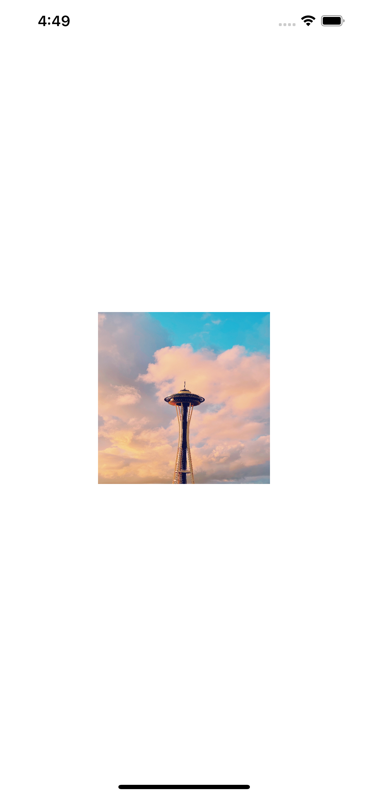

# JCTTool

### Make UI Creation Simple.

Are you bored with programmtic auto layout then this package will help you to create beautiful UI with programmatic auto layout.

##### How to add a size to an UIImageView?

```
import UIKit
import JCTTool // When Using JCTTool need to import the package

class ViewController: UIViewController {
    
    //MARK:- Property
    let profileImage:UIImageView = {
        let imgView = UIImageView()
        imgView.image = UIImage(named: "profile")
        return imgView
    }()
    //MARK:- LifeCycle
    
    override func viewDidLoad() {
        super.viewDidLoad()
        view.addSubview(profileImage)
        congigUISimpleLayoutFunc()
        congigUIJCTToolFunc()
    }

    //MARK:- Helper

    /// Without using JCTTool

    func congigUISimpleLayoutFunc(){
        profileImage.translatesAutoresizingMaskIntoConstraints = false
        profileImage.heightAnchor.constraint(equalToConstant: 200).isActive = true
        profileImage.widthAnchor.constraint(equalToConstant: 200).isActive = true
        
    }

    /// When we use JCTTool we need to add only 1 line of code 
    
    func congigUIJCTToolFunc(){
        profileImage.setDimensions(width: 200, height: 200)
    }
}
```


#### If we want to place the image to the center of the  parent view .

```
profileImage.center(inView: self.view)
```


#### If we want to place the image top center of the parent view.
 ```
 profileImage.centerX(inView: view, topAnchor: view.topAnchor, paddingTop: 40)
 ```

 

 #### if we want to create a Floating Button with Color Code hex

 ```
import UIKit
import JCTTool

class ViewController: UIViewController {
    
    //MARK:- Property
    let profileImage:UIImageView = {
        let imgView = UIImageView()
        imgView.image = UIImage(named: "profile")
        return imgView
    }()
    
    let floatingButton : UIButton = {
        let btn = UIButton()
        btn.setImage(UIImage(systemName: "plus"), for: [])
        btn.layer.cornerRadius = 25
        btn.backgroundColor = UIColor.init(hex: "#76448A") // hex Color Code
        btn.imageView?.tintColor = .white
        return btn
    }()
    
    //MARK:- LifeCycle
    
    override func viewDidLoad() {
        super.viewDidLoad()
        view.addSubview(profileImage)
        view.addSubview(floatingButton)
        congigUIJCTToolFunc()
    }
    
    //MARK:- Selection
    
    //MARK:- Helper
    func congigUIJCTToolFunc(){
        profileImage.center(inView: view)
        profileImage.setDimensions(width: 200, height: 300)
        floatingButton.anchor(top: nil, left: nil, bottom: view.safeAreaLayoutGuide.bottomAnchor, right: view.rightAnchor, paddingTop: 0, paddingLeft: 0, paddingBottom: 20, paddingRight: 20, width: 50, height: 50)
    }
}
 ```

 